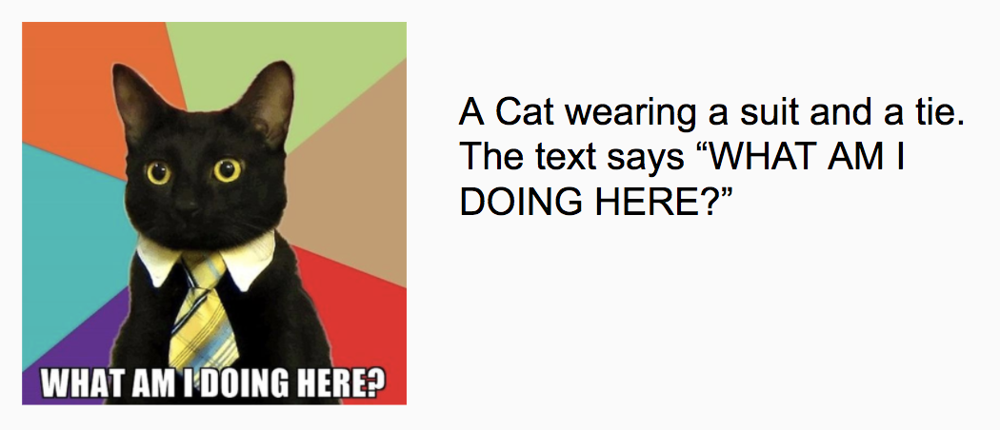

## Improving the internet for the millions, with just a weekend
_Guest blog by [Luke Harries](https://www.linkedin.com/in/luke-harries/), representing the Microsoft Cognitive Services winners at HackCambridge._

HackCambridge provided the perfect opportunity to return to Cambridge University. It is where I completed my undergraduate degree in Medicine and Cognitive Neuroscience, before moving to UCL to study a masters in Computer Science. Our team included [Filip](https://www.linkedin.com/in/filipkozera/), a masters student in information engineering at Cambridge, where he is using deep learning on EMG signals to control prosthetics; [Marcin](https://www.linkedin.com/in/marcin-kolaszewski-07912314a/), a joint honors Mathematics and Computer Science student from Brown University; and [Mateusz](https://www.linkedin.com/in/mateusz-jakub-staniszewski-19946590/), a recent Mathematics graduate from Imperial and a current Software Engineer at BlackRock.

With flights from Poland to London for two of the team members booked, we starting discussing ideas for what would be our first Hackathon together. Our ideas ranged from trying to implement a decentralised ICO ([DAICO](https://ethresear.ch/t/explanation-of-daicos/465)) to controlling a VR world with a [Myo armband](https://www.myo.com/). 

As the event neared, Microsoft released a video of their Seeing AI app to to announce their involvement as a keen sponsor and willingness for us to engage in their project  [Seeing AI app](https://www.youtube.com/watch?v=R2mC-NUAmMk). The video demonstrated how Saqid Shaikh, a visually impaired software developer at Microsoft, used the app he created, to convert a visual world into an audible experience. **It was incredible**. The app could describe kids playing Frisbee in the park, or allow him to read a menu. We could only imagine the impact it had on him and many others with visual impairments.

We knew we wanted to build on SeeingAI's fantastic work. We initially discussed building an Android app equivalent, possibly in conjunction with Myo Armband for hands-free control. However, with five minutes to go before the hackathon started and much excitement, it dawned on us how much of the internet was still inaccessible to the visually impaired in this day and age. We were committed to solving a problem which affects 32 million people worldwide in the hope of having a true social impact

## The problem

People with visual impairments frequently rely on a Screen Reader to navigate the internet. The Screen Reader reads out the written content of each page. However, when the Screen Reader reaches an image it has to rely on the “alt tag” to provide a caption. For the majority of the internet these “alt tags” are either missing (think of any user-uploaded content such as Twitter or LinkedIn), superficial or inaccurate.

> This affects millions of people every day.

  

_The Screen Reader would not pickup any details of this "Hot Job"_

## The solution

Once we had narrowed down the problem, coming up with the solution was much easier. We decided we would bring Facebook's automatic "alt tag" generation to every page on the internet (right click on your profile picture, click inspect element and see what Facebook's sees!).

By using a Chrome extension we could scan through every element on the page looking for images lacking an "alt tag". For each image where the "alt tag" was missing, we would send the image URL to an Azure cloud function. The cloud function would check if we already had the "alt tag" saved and if so return it. If not we would use the Microsoft's Cognitive Services Vision API to perform object recognition and generate the description to be added as the "alt tag". 

We split into pairs: Mateusz and I built the Chrome extension, and Filip and Marcin built the cloud function and connect it to the Cognitive Services API. We started programming at 2 pm and by 9 pm we already had a fully functional prototype. The speed, accuracy and ease of integration with which the image descriptions were being generated would not have been possible just a few years ago. The extra time allowed us to link in three more APIs: facial recognition, emotion recognition and OCR (image to text), depending on what was in the image. This provided much more descriptive image captions.
> The speed, accuracy and ease of integration with which the image descriptions were being generated would not have been possible just a few years ago.

(Watch a demo)[https://www.youtube.com/watch?v=SesPIkT-Sn8]

### What's next?

We are really proud of what we have built so far and cannot wait to release it to the public. We hope our Chrome extension will empower those with visual impairments to browse the web, without having to rely on others to create the "alt tags".

